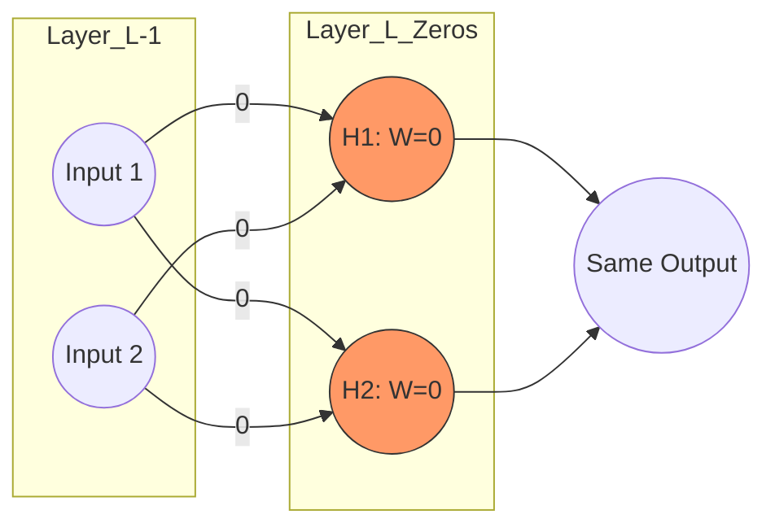
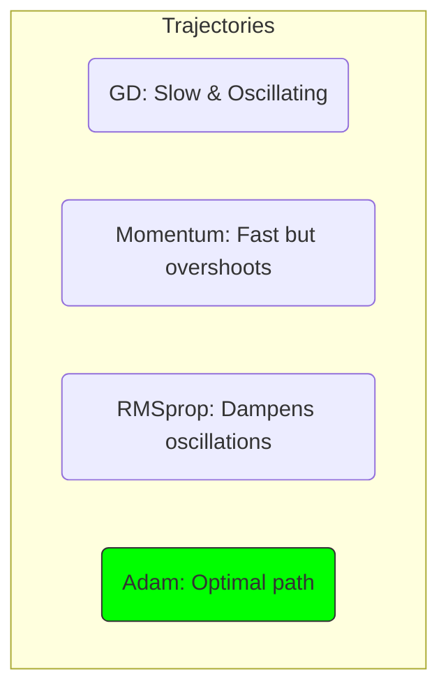

# 6. Optimizers and Weight Initialization

> [!quote] "Give me a lever long enough and a fulcrum on which to place it, and I shall move the world." — Archimedes
> In Deep Learning, the "lever" is our weight initialization, and the "fulcrum" is our optimizer.

Neural Networks are like high-performance sports cars. In the previous chapters, we built the engine (Architecture) and the sensors (Propagations). But if you start a race with flat tires (Bad Weights) or a driver who can't find the finish line (Bad Optimizer), you're not going anywhere fast. Today, we're talking about how to start the race and how to drive to the podium.

---

## 6.1 The Art of the Starting Line: Weight Initialization

Imagine you're trying to reach the bottom of a fog-covered valley (Global Minimum). Weight initialization is your "drop-off point." If you start at the top of a cliff, you might fall too fast (Exploding Gradients). If you start in a flat swamp, you might never move (Vanishing Gradients).

### Why not just use Zero? (The Symmetry Problem)
If all weights are initialized to zero, every neuron in a hidden layer receives the same input and produces the same output.
- [c] **Symmetry Problem**: During backpropagation, the gradients for all weights in a layer will be identical. All neurons will update to the exact same value.
- [!] **Consequence**: The hidden layer effectively collapses into a single "clone" neuron. We need **randomness** to break this symmetry.

### The Mathematics of Variance Preservation
In a deep network, we want the "volume" of our signal (activations) to stay consistent. If the variance grows, gradients explode; if it shrinks, they vanish.
For a linear layer $z^l = \sum_{i=1}^{n} w_i a_i^{l-1}$, assuming $w$ and $a$ are independent with mean 0:
$$
Var(z^l) = n \cdot Var(w) \cdot Var(a^{l-1})
$$
To keep the signal strength constant ($Var(z^l) = Var(a^{l-1})$), we mathematically require:
$$
Var(w) = \frac{1}{n}
$$

### Modern Solutions: Xavier and He

#### [i] Xavier / Glorot Initialization (for Sigmoid/Tanh)
Xavier assumed a linear activation (near-origin Sigmoid behavior). It balances both forward signal and backward gradients.
- **Normal Distribution**: $W \sim N\left(0, \sqrt{\frac{2}{n_{in} + n_{out}}}\right)$
- **Uniform Distribution**: $W \sim U\left(-\frac{\sqrt{6}}{\sqrt{n_{in} + n_{out}}}, \frac{\sqrt{6}}{\sqrt{n_{in} + n_{out}}}\right)$

#### [i] He Initialization (for ReLU)
ReLU "kills" half the distribution (negative values). To keep the energy level up, He initialization doubles the variance of Xavier.
- **The "ReLU Fix"**: $Var(W) = \frac{2}{n_{in}}$
- **Implementation (Normal)**: $W \sim N\left(0, \sqrt{\frac{2}{n_{in}}}\right)$

> [!tip]
> Keras uses Glorot Uniform by default. If you use ReLU, switch to `kernel_initializer='he_normal'`. It's the difference between a sputtering start and a clean takeoff!

---

## 6.2 Driving to the Minimum: Optimizers

Once we've started, how do we move? Standard Gradient Descent is like a hiker who only looks at their feet. For Deep NN, we need a driver with better intuition.

### The Problem with Standard Gradient Descent
- [i] **Batch GD**: Uses the whole dataset. Slow as a snail on a large hill.
- [i] **Stochastic GD (SGD)**: Uses 1 sample. Jumps around like a **caffeinated kangaroo**.
- [i] **Mini-Batch GD**: The Goldilocks zone (32-128 samples).

### Navigating the "Ravine"
In high-dimensional space, the loss landscape is like a narrow ravine. SGD might bounce back and forth between the walls instead of sliding down the center. This "wasted motion" is why training takes so many epochs.

#### 1. Momentum: The Heavy Boulder
Momentum adds an **Exponential Moving Average** of previous gradients. Imagine a heavy boulder rolling down a hill—it gains velocity in the direction that consistently goes down, while "canceling out" the vibrations from side to side.

$$
V_t = \beta V_{t-1} + (1-\beta) \nabla W
$$
$$
W = W - \alpha V_t
$$

#### 2. RMSprop: Adapting the Tires
RMSprop (Root Mean Square Propagation) scales the learning rate by **squaring** the gradients. 
- If we are oscillating wildly (large $(\nabla W)^2$), we divide by a large number and dampen the step.
- It "normalizes" our speed across different dimensions.

$$
S_t = \beta S_{t-1} + (1-\beta) (\nabla W)^2
$$
$$
W = W - \frac{\alpha}{\sqrt{S_t + \epsilon}} \nabla W
$$

#### 3. Adam: The King of Optimizers
**Adam (Adaptive Moment Estimation)** combines Momentum (1st moment) and RMSprop (2nd moment).

**Bias Correction**: Because $M_t$ and $V_t$ start at zero, they are biased toward zero early on. Adam "warms them up":
$$
\hat{M_t} = \frac{M_t}{1-\beta_1^t}, \quad \hat{V_t} = \frac{V_t}{1-\beta_2^t}
$$
**Update Rule**:
$$
W = W - \alpha \frac{\hat{M_t}}{\sqrt{\hat{V_t}} + \epsilon}
$$

---

## Summary (Whats Next?)
> [!info] 
> Use **He Init** + **Adam Optimizer** as your baseline. It's the most robust setup for most Deep Learning architectures today.

We've learned how to start well and move fast. In the next chapter, we'll look at **Regularization**, or how to make sure our network doesn't just "memorize" the homework but actually understands the subject!
